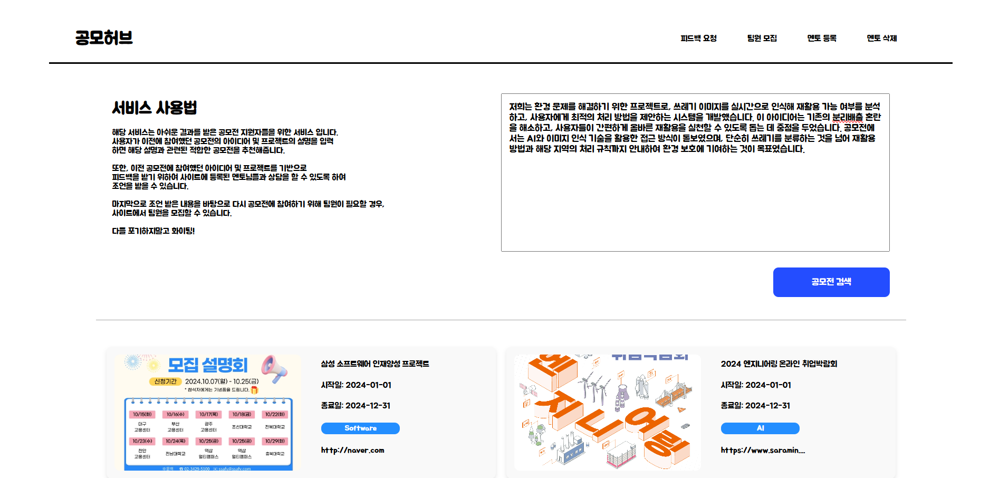

# GongMo-Hub

## Table of Contents

[1. Introduce](#introduce)  
[2. What I Did](#what-i-did)  
[3. Project Architecture](#project-architecture)  
[4. Team](#team)  
[5. View](#view)  
[6. Tech Stack](#tech-stack)  

## Introduce
유저가 자신의 프로젝트와 일치하는 공모전을 쉽게 찾을 수 있도록 해 보다 많은 공모전에 참여할 수 있는 도록 도와주는 플랫폼 서비스  
2024. 10. 07. ~ 2021. 10. 08.   

휘발성으로 끝날 수 있었던 프로젝트들을 간단한 검색으로 주제에 맞는 공모전에 제출해 수상의 기회를 제공하여 프로젝트의 가치를 극대화합니다. 마지막으로 공모전 참여 유도를 통해 최종적으로 공모전 수상 실적은 학생들의 포트폴리오를 풍부하게 만들어줍니다.

## What I Did
- 형태소 분석 라이브러리를 활용해서 자연어에서 명사들을 추출하여 QueryDSL로 동적 쿼리 생성 후 반환하는 로직 구현
- AWS EC2 배포

## Team
|  이름  |             [김보성](https://github.com/NangManBo)             |                  [이상현](https://github.com/idealHyun)                   |                [이창의](https://github.com/changuii)                 |                     [한동근](https://github.com/l0o0lv)                      |
| :----: | :------------------------------------------------------------: | :-----------------------------------------------------------------------: | :------------------------------------------------------------------: | :--------------------------------------------------------------------------: |
| 프로필 |  |             |        |                |
|  역할  |     메인 페이지 구현 멘토 페이지 구현 API 연결 작업      | 페이지 디자인 작업 팀원 모집 작성 및 조회 페이지 공모전 조회 페이지 | 자바 형태소 분석 개발 AWS, Docker 이용 배포 QueryDSL 쿼리 개발 | 멘토, 공모전, 모집글 개발 데이터베이스 설계 및 개발 API 개발 문서 작성 |

## View

<table>
  <tr>
    <td align="center">메인페이지</td>
    <td align="center">메인페이지(입력)</td>
  </tr>
  <tr>
    <td></td>
    <td></td>
  </tr>
  <tr>
    <td align="center">공모전 검색 결과 페이지</td>
    <td align="center">멘토에게 피드백 요청 페이지</td>
  </tr>
  <tr>
    <td></td>
    <td></td>
  </tr>
  <tr>
    <td align="center">멘토 등록 페이지</td>
    <td align="center">멘토 삭제 페이지</td>
  </tr>
  <tr>
   <td></td>
    <td></td>
   
  </tr>
  <tr>
    <td align="center">팀원 모집 게시글 작성 페이지</td>
    <td align="center">팀원 모집 페이지</td>
  </tr>
  <tr>
    <td></td>
    <td></td>
  </tr>
</table>

## Tech Stack

<table width="1000px">
  <tr>
    <th style="text-align: center; background-color: #E0E0E0; padding: 10px;">BACK END</th>
    <th style="text-align: center; background-color: #E0E0E0; padding: 10px;">FRONT END</th>
  </tr>
  <tr>
    <td align="center" style="padding: 20px; background-color: #ffffff;">
      
      
      
      
      
    </td>
    <td align="center" style="padding: 20px; background-color: #ffffff;">
      
      
      
      
      
    </td>
  </tr>
</table>
